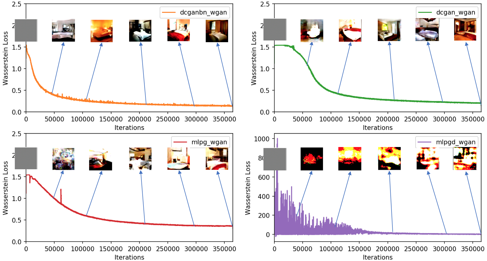

# Wasserstein GAN

This repository contains implementation of [WGAN](https://arxiv.org/abs/1701.07875) and [DCGAN](https://arxiv.org/abs/1511.06434) in [Julia](https://julialang.org/)
using [Knet](https://github.com/denizyuret/Knet.jl). Here is a detailed [report](https://ceteke.github.io/assets/report.pdf) about WGAN.

## Usage

Just run ```julia train.jl``` with the following arguments. Note that if procedure is ```gan```, discriminator weights won't get clipped.

```
usage: train.jl [--gpu GPU] [--dn DN] [--type TYPE] [--data DATA]
                [--procedure PROCEDURE] [--zsize ZSIZE]
                [--epochs EPOCHS] [--report REPORT]
                [--batchsize BATCHSIZE] [--lr LR] [--clip CLIP]
                [--opt OPT] [--leak LEAK] [--out OUT] [-h]

WGAN Implementation in Knet

optional arguments:
  --gpu GPU             GPU ID if -1 don't use GPU (type: Int64,
                        default: 0)
  --dn DN               Train discriminator n times (type: Int64,
                        default: 1)
  --type TYPE           Type of model one of: [dcganbn (regular
                        DCGAN), mlpg (Generator is MLP),         mlpgd
                        (Both MLP), dcgan (Generator has no BN and has
                        constant filter size)] (default: "dcganbn")
  --data DATA           Dataset dir (lmdb) (default: "/home/cem/lsun")
  --procedure PROCEDURE
                        Training procedure. gan or wgan (default:
                        "gan")
  --zsize ZSIZE         Noise vector dimension (type: Int64, default:
                        100)
  --epochs EPOCHS       Number of training epochs (type: Int64,
                        default: 20)
  --report REPORT       Report loss in n iterations (type: Int64,
                        default: 500)
  --batchsize BATCHSIZE
                        Minibatch Size (type: Int64, default: 64)
  --lr LR               Learning rate (type: Float64, default: 0.0002)
  --clip CLIP           Clip value (type: Float64)
  --opt OPT             Optimizer, one of: [adam, rmsprop] (default:
                        "adam")
  --leak LEAK           LeakyReLU leak. (type: Float64, default: 0.2)
  --out OUT             Output directory for saving model and
                        generating images (default: "./models")
  -h, --help            show this help message and exit
```
  
  ## Learning Curves and Outputs
  Images below are the plots of the outputs of the implementation in this repo. Original outputs can be found [here](https://github.com/martinarjovsky/WassersteinGAN)
  ### Standard GAN
  
  
  ### Wasserstein GAN
  
